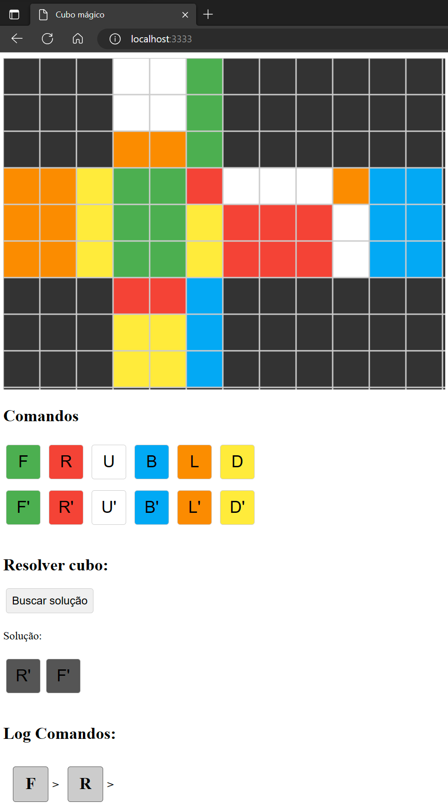

# resolvedor-cubo-magico

## Bacharelado em Sistemas de Informação

## Inteligência Artificial–Atividade 01–semestre 2023/I

---

### Escopo do Trabalho:

O objetivo deste trabalho e implementar um resolvedor de Cubo Magico (Rubik’s Cube Solver). Para tal, o grupo poderá utilizar qualquer algoritmo que desejar, desde que:

- As dimensões do cubo sejam 3x3x3.
- Seja possível configurar o estado inicial de forma manual e também gerar um estado inicial de forma aleatória (ou seja, “misturar o cubo”).
- Todos os passos executados pelo resolvedor até a resolução final do cubo sejam mostrados e possam ser auditados.

### Como rodar:

Caso queira editar alguma coisa:

- `npm install` - Instalar as dependências

- `npm run build` - Transpilar o projeto e gerar o arquivo `./dist/bundle.js`

Independente se executou o passo anterior, para visualizar o cubo:

- Rodar o arquivo `index.html` a partir de um servidor (ex.: http://localhost/index.html)

> Exemplo cubo 2D
> 
